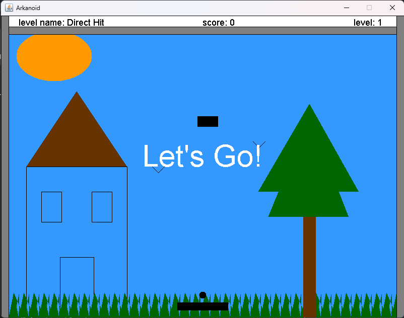

# Arkanoid Game Project

This is a Java-based implementation of the classic arcade game Arkanoid. The project showcases Java programming skills and utilizing GUI and following Object-Oriented Programming (OOP) principles, including game mechanics, collision detection, graphics rendering, and user input handling.

## Installation

To run the Arkanoid game project, follow these steps:

1.  Clone this repository to your local machine.
2.  Ensure you have the Java Development Kit (JDK) installed.
3.  Compile the Java code using an IDE or the command line.
4.  Run the compiled code.

## Running the Game

To run the game, execute the compiled Java code. You can choose specific levels by passing them as arguments when running the Java code. For example, you can specify the levels by entering the level numbers (1-4) as command-line arguments when launching the game. For example, to run levels 1, 2, 4, 3, and 2, pass the numbers "1 2 4 3 2" as arguments.

## How to Play

-   Move the paddle using the arrow keys or mouse to deflect the ball.
-   Destroy all the blocks by hitting them with the ball.
-   Be careful not to let the ball fall off the bottom of the screen.
-   Catch power-ups dropped by blocks to gain advantages.
-   Aim for the highest score and try to surpass your previous records.

## Physics of the Game

The Arkanoid game project incorporates basic physics principles to simulate the movement and interactions of the ball and paddle:

-   The ball's velocity determines its speed and direction of travel.
-   The paddle's position affects the angle at which the ball bounces off it.
-   Collision detection algorithms are used to determine when the ball collides with the paddle or blocks.
-   When the ball collides with a block, it changes direction and may destroy the block.
-   Power-ups, represented by special items, are dropped by blocks and can be collected by the paddle to enhance gameplay.

## Contributing

Contributions are always welcome! If you have any ideas for improvements or new features, feel free to submit a pull request.

Enjoy the game and have fun breaking those blocks!
